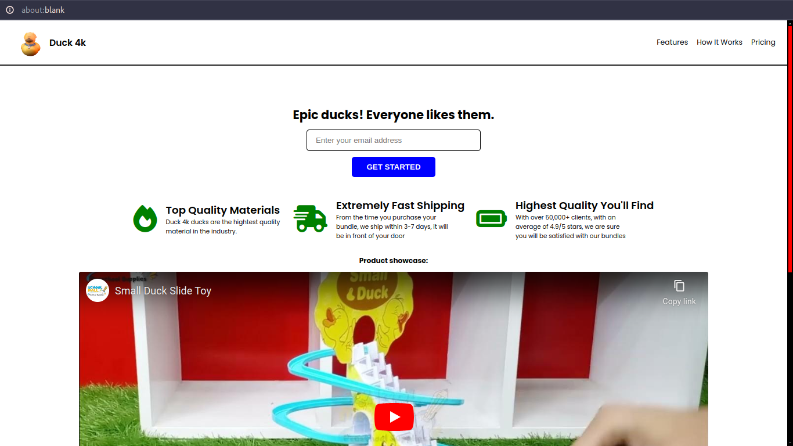

# Rubber Duckie Product Landing Page!

A **product landing page** for something nobody can hate, rubber duckies. Feel free to check out the rubber duckie product landing page by clicking <a href="https://duckie-product-page-ten.vercel.app/" target="_blank">here</a>.

## Why love rubber duckies?
1. Your pet dog likes them
2. More money, because duckies will make you more happy. Statistically, happier people usually make more money
3. Smarter, because happy people are usually smarter aswell.
4. Flex: not everyone have rubber duckies.

## Technologies:
1. HTML
2. CSS

## Project Motive:
This is a certification project I get to do, for the course I am following. The project, is to make a product landing page. I started to think: "What would everyone else do?", and did the exact opposite. I spent like 10 to 20 minutes to just think of a unique idea, something nobody else would do. 

## Contributions:
If you really like the idea of this project, and you see something you can improve, feel free to **fork** this repo, make your changes, and submit a pull request. If you love rubber duckies alot, welcome!

## What I learnt from making this project:
1. HTML
2. CSS
3. Responsive Design

## License:
This project is under the MIT license. Feel free to do whatever you wnat with it, I really don't care.

## Conclusion:
If you are someone that are looking to hire a developer, whether it is freelancing work, an internship, or a full time position, feel free to reach out to me with one of the following channels: 

  
  
  &nbsp;&nbsp;&nbsp;

